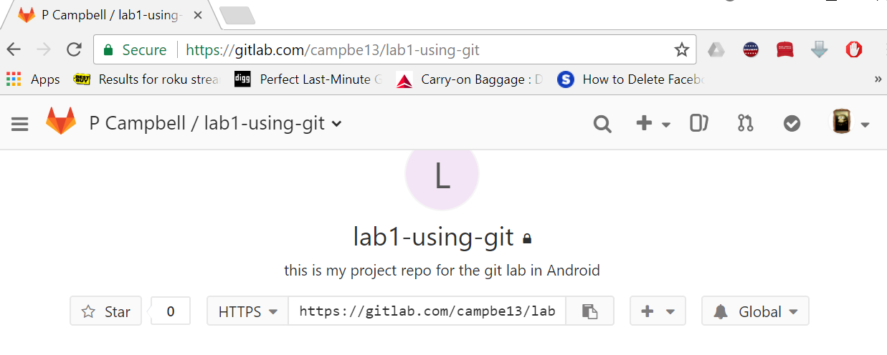
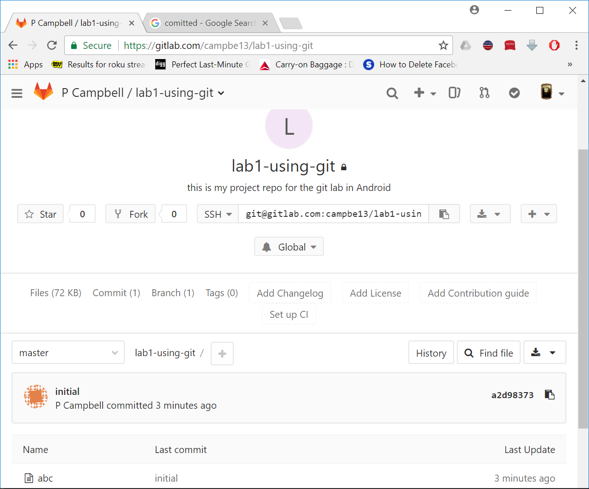

# Git Tutorial, Part 1

Summary: create a local repository, make commits, set up a remote repository,
push to and pull from the remote.

Commands shown: `git init`, `git status`, `git add`, `git commit`, `git diff`,
`git log`, `git clone`, `git remote`, `git push`, `git pull`

## What is git?

git is a client-server version control system created in 2005 by Linus
Torvalds.

* It keeps track for project history in terms of "revisions", also knowns as
"commits". Every time you want to save a snapshot of your repository files
in history, you use git to create a commit.  
* This allows you (and teammates) to work on different aspects of a big project
at the same time, without stepping on each other's toes.

The client is the git command the server is any repo server
<http://github.com>, <https://bitbucket.org/>, <http://gitlab.com>, or
one that you host yourself, etc.
met
The examples in here use github but could easily be swapped for
bitbucket or gitlab.

### Resources

* If you already know how to use git but can't remember some sequence
check here [git quick ref](git_quick_ref "wikilink")
* This is all command line. If you re having trouble remembering the bash
command line here are some
[references](https://drive.google.com/open?id=0B-CHlg81QPjfVU5PSkxYM1hsSEE)
<http://bit.ly/bashqr>

## Definitions: "local" versus "remote"


* A __local__ repo is one that is on your computer. It is possible to use git
only locally, and never even communicate with a server. In that case, you get
the benefit of version control and history for yourself, but you can't
collaborate with anyone.
* A __remote__ repo is one that is hosted on a server like gitlab.com. By pushing
a copy of your local repo to a remote repo, you get a back-up of your files
on the server and therefore access them any other computer. This also allows
you to share your repo with other and collaborate.


## Set up a local repo


1. Configure your git client side (the repo will exist first locally then
also remotely).

2. Open a git-bash command line window & configure your client. (In the labs
this will configure the git client info in the H: drive.)
If you are
running on Linux just make sure git is installed.

If this is your first time using git, then set up the config:

``` {.bash}
$ git config --global user.name "Grace Hopper"
$ git config --global user.email "gracie@ilovelinux.ca"
$ git config --global color.ui "auto"
```

To check the settings (this or next time)

``` {.bash}
$ git config --list
```

To get help

``` {.bash}
$ git config -h
$ git config --help
```

We are going to make an example local repository. Do this on
the h: drive (from <http://swcarpentry.github.io/git-novice/03-create/>)

``` {.bash}
$ mkdir planets
$ cd planets
```

make the directory into a git repository , cwd is h:\\planets

``` {.bash}
$  git init .
Initialized empty Git repository in planets/.git/
```

A git repo is just a directory that contains a `.git` directory as well as
whatever files you want to keep track of.

The `.git` directory is where `git` keeps track of all the file history and other
meta-data of the files in `planets`. You pretty much never have to do anything
_in_ the `.git` directory: that's what git commands do for you.

```
$ ls -a   
.  ..  .git
$ git status
```

``` {.bash}
# On branch master
#
# Initial commit
#
nothing to commit (create/copy files and use "git add" to track)
```

_Use `git status` often: it often gives you hints about how to fix mistakes._

## Add files to the repo

Create a file in the planets directory (Reference:
<http://swcarpentry.github.io/git-novice/04-changes/>)

``` {.bash}
$ vi pluto.txt   #  put some text in here "alas it is no more"  & save it
$ git status
```

``` {.bash}
# On branch master
#
# Initial commit
#
# Untracked files:
#   (use "git add <file>..." to include in what will be committed)
#
#   pluto.txt
nothing added to commit but untracked files present (use "git add" to track)
```

To start paying attention to changes in a file, you `add` it. This
tells git to "stage" your file in the __index__: the index represents the changes
that will be recorded in your repo history if you decide to commit them.

``` {.bash}
$ git add pluto.txt
$ git status
```

``` {.bash}
# On branch master
#
# Initial commit
#
# Changes to be committed:
#   (use "git rm --cached <file>..." to unstage)
#
#   new file:   pluto.txt
#
```

### Possible status of files in a git repo

> `untracked`:
> Files that aren't tracked by Git yet. This usually indicates a newly created file.
>
> `staged` (in the index):
> The result of git add: tracked files that are ready to be committed.
>
> `unstaged` (not in the index):
> Tracked files with changes that have not been "git-added".


You can see the staged changes as follows:

```{.bash}
git diff --staged
```

## Commits

Tell git save a snapshot of file history by recording the changes that you
added to the index.

``` {.bash}
$ git commit -m "Create first planet file."
```

The message "Create first planet file" describes the changes made by that
commit.


``` {.bash}
[master (root-commit) f22b25e] Create first planet file.
 1 file changed, 1 insertion(+)
 create mode 100644 pluto.txt
```

make sure it committed ok

``` {.bash}
$ git status
```

``` {.bash}
# On branch master
nothing to commit, working directory clean
```

all commits in reverse chronological order:

``` {.bash}
$ git log
```

``` {.bash}
commit f22b25e3233b4645dabd0d81e651fe074bd8e73b
Author: Grace Hopper <gracie@ilovelinux.ca>
Date:   Thu Aug 22 09:51:46 2013 -0400

    Create first planet file.
```

It is a widely adopted practice to start commit messages with a
imperative verb, so that each message sounds like a command or a step in an
algorithm: "List all passengers by name.", "Remove multiplication method."
This makes the history easier to read when use `git log` and other tools.

modify the file

``` {.bash}
$ vi pluto.txt   #  add a new line of text "we miss you pluto"  & save it
$ git status
```

``` {.bash}
# On branch master
# Changes not staged for commit:
#   (use "git add <file>..." to update what will be committed)
#   (use "git checkout -- <file>..." to discard changes in working directory)
#
#   modified:   pluto.txt
#
no changes added to commit (use "git add" and/or "git commit -a")
```

Look at the changes before saving them; git detects that it doesn't match
what is in the first commit

``` {.bash}
git diff
```

Output of git diff:

``` {.bash}
diff --git a/pluto.txt b/pluto.txt
index 9f83956..0ce4e22 100644
--- a/pluto.txt
+++ b/pluto.txt
@@ -1 +1,2 @@
 alas it is no more
+we miss you pluto
```

so now try to commit

``` {.bash}
$ git commit -m "Add sentiment"
On branch master
Changes not staged for commit:
    modified:   pluto.txt

no changes added to commit

$ git status
```

NOPE!

``` {.bash}
# On branch master
# Changes not staged for commit:
#   (use "git add <file>..." to update what will be committed)
#   (use "git checkout -- <file>..." to discard changes in working directory)
#
#   modified:   pluto.txt
#
no changes added to commit (use "git add" and/or "git commit -a")
```

We need to add it to the index (staging area) before committing: __add then commit__

``` {.bash}
$ git add pluto.txt
$ git commit -m "Add sentiment"
```

Success!

``` {.bash}
[master 340b5d6] add sentiment
 1 file changed, 1 insertion(+)
```

So getting files into a repo is a 2 part process: untracked changes
--(git add)-&gt; staging area --(git commit)--&gt; repository


## Set up a server side repo (a remote repo)


For this exercise we are going to use gitlab.

1.  If you don't have a gitlab account create one
    <https://gitlab.com/users/sign_in>
2.  Once you have created your account logon, to create a new Project repo click
    on Project Dashboard then New project button:
    
3.  Select new repository then fill in the info & click on the green
    button:
    
4.  If the repo is created properly you will see this;
     (Do NOT create a README nor any other files)
    
    -   After the first part you had a local repo called planets, now
        you have an empty repo called planets on the github server
        effectively you just did this on gitlab:
        ``` {.bash}
        mkdir planets;cd planets;git init .
        ```

Connect your local repo to your remote repo
-------------------------------------------

What we need to do to connect them is to tell the local repo to talk to
a remote repo on github.com. This is called __adding a remote__.

It is better to use
ssh but you will need to set up keys for that, https you can use
userid/password. So we'll use https for now.

Note server side == remote && client side == local

From the website copy the https url into your clipboard


Go to your local repo directory (git-bash command line)

Below shows my repo URL, use your own
``` {.bash}
# go into repository directory (you already did a git init here)
$ cd planets

# add a remote with name "origin" and url github.com..
$ git remote add origin https://gitlab.com/campbe13/lab1-using-git.git

# verify it
$ git remote -v
origin  https://gitlab.com/campbe13/lab1-using-git.git (fetch)
origin  https://gitlab.com/campbe13/lab1-using-git.git (push)
```

"origin" is a standard name for the primary remote used by your local repo.
We could have used any string for this label.

Now that the local (client) repo knows about the remote (server) repo, let's
sync them. You remote repo on gitlab is empty, so let's send your history
from the local repo to the remote repo.

`git push` is the command for sending data to a remote. Below, we know
"origin" represent the URL to planets.git on github.com. We'll explain
what "master" is next time, but for now you can think of "master" as a label
the most recent commit you made.

Note we have previously added and committed the files in the staging area.

``` {.bash}
$ git push origin master
```

So this command is saying: take all the commits in history up to the point
labeled "master" and send them to the remote called "origin"

We need to authenticate on the server:

``` {.bash}
Counting objects: 3, done.
Delta compression using up to 4 threads.
Compressing objects: 100% (2/2), done.
Writing objects: 100% (3/3), 214 bytes | 0 bytes/s, done.
Total 3 (delta 0), reused 0 (delta 0)
To https://gitlab.com/campbe13/lab1-using-git.git
 * [new branch]      master -> master
```

Now the contents of the local repo are on the remote, reload the page:\


Add a README.md, for now just put in some basic text, you can get more
sophisticated later, with markdown
<https://help.github.com/articles/basic-writing-and-formatting-syntax/>

You can use this method to add any files to your own repos.

``` {.bash}
tricia@ubbie:~/planets$ echo "My first repo" > README.md
tricia@ubbie:~/planets$ git add README.md
tricia@ubbie:~/planets$ git commit -m "add readme"
[master ef2c0b8] add readme
 1 file changed, 1 insertion(+)

 create mode 100644 README.md
tricia@ubbie:~/planets$ git push origin master
Counting objects: 3, done.
Delta compression using up to 4 threads.
Compressing objects: 100% (2/2), done.
Writing objects: 100% (3/3), 284 bytes | 0 bytes/s, done.
Total 3 (delta 0), reused 0 (delta 0)
To https://github.com/campbe13/planets.git
   340b5d6..ef2c0b8  master -> master
```

Reload the page it will show you the README.md

##  Using your repo from a new computer

*You can do this part from home or from your laptop.*

Again this example uses gitlab but any remote server repo will work
similarly.

This is for anywhere you are using a new computer or want to use a clean
copy of you repository from the remote (github).

So you created a repo and the contents are the same on the lab computer
h: drive repo and on the remote github repo. You go home and you want to
use the same repo on another computer.

Hopefully you are doing this on Linux, otherwise you will have to first
install git-bash @ home <https://git-scm.com/downloads>

*<font color="#0000ee">*'This is where you may want to set up ssh keys,
I will show you that separately. *'</font>*

When I clone it I get a copy of the whole directory. By default, cloning will
set up a remote called "origin" for you, so you don't have to do it manually
this time.

``` {.bash}
$ git clone https://github.com/campbe13/planets.git
Cloning into 'planets'...
remote: Counting objects: 9, done.
remote: Compressing objects: 100% (4/4), done.
remote: Total 9 (delta 0), reused 9 (delta 0), pack-reused 0
Unpacking objects: 100% (9/9), done.
Checking connectivity... done.

$ cd planets
$ ls -l
total 8
-rw-rw-r-- 1 tricia tricia 38 Aug 28 19:51 pluto.txt
-rw-rw-r-- 1 tricia tricia 14 Aug 28 19:51 README.md
```


So now there are 3 identical copies of this repository:
1. on your h: drive
2. on gitlab
3. on your home computer (or wherever you cloned just now).

modify some files, and/or create new ones, work with the directory I
added home-planet.txt and changed README.md

This only changes the local files! It does not affect anything on the other
copies of this repo (remote, or other local.)

``` {.bash}
$ vi home-planet.txt
$ ls -l
total 12
-rw-rw-r-- 1 tricia tricia 32 Aug 28 19:54 home-planet.txt
-rw-rw-r-- 1 tricia tricia 38 Aug 28 19:51 pluto.txt
-rw-rw-r-- 1 tricia tricia 14 Aug 28 19:51 README.md
$ vi README.md
$ git diff
diff --git a/README.md b/README.md
index b85b88f..cc8bdcd 100644
--- a/README.md
+++ b/README.md
@@ -1 +1,3 @@
 My first repo
+
+modified Saturday to fix the thingy error
$ git add .
$ git status
On branch master
Your branch is up-to-date with 'origin/master'.
Changes to be committed:
  (use "git reset HEAD <file>..." to unstage)

    modified:   README.md
    new file:   home-planet.txt
```

remember `add` will update the staging area (the index), `commit` will save
history in the local repo

``` {.bash}
$ git commit -m "done for today will work from school tomorrow"
[master c3993b1] done for today will work from school tomorrow
 2 files changed, 3 insertions(+)
 create mode 100644 home-planet.txt
```

If I want to use it from school tomorrow I need to push these changes to
the remote repo.

``` {.bash}
$ git push origin master
...
Counting objects: 4, done.
Delta compression using up to 4 threads.
Compressing objects: 100% (3/3), done.
Writing objects: 100% (4/4), 432 bytes | 0 bytes/s, done.
Total 4 (delta 0), reused 0 (delta 0)
To https://github.com/campbe13/planets.git
   ef2c0b8..c3993b1  master -> master
```

Now the remote (server) gitlab repo contains my latest changes.

Using your repo back on first computer (in the lab)
---------------------------------------------------

So you committed a change in the repo at home, pushed to your remote, and now
you want to work on the repo in the school lab again. Your home and remote
repo are up-to-date, but your lab repo is not. How do you get the
changes you made at home?

Before you make any new changes in your local lab repo, make sure you update it
with any changes from the remote (gitlab) with `git pull`.

``` {.bash}
$ ls
pluto.txt  README.md
$ git pull origin master
From https://gitlab.com/campbe13/planets
 * branch            master     -> FETCH_HEAD
Updating ef2c0b8..c3993b1
Fast-forward
 README.md       | 2 ++
 home-planet.txt | 1 +
 2 files changed, 3 insertions(+)
 create mode 100644 home-planet.txt
```

Now your local repo matches the remote (gitlab) you can work on this,
don't forget to update the remote again as needed & when you are
finished.

``` {.bash}
$ ls -l
total 12
-rw-rw-r-- 1 tricia tricia 32 Aug 28 20:07 home-planet.txt
-rw-rw-r-- 1 tricia tricia 38 Aug 28 17:12 pluto.txt
-rw-rw-r-- 1 tricia tricia 57 Aug 28 20:07 README.md
```

I added important-work.txt and updated home-planet.txt

``` {.bash}


$ git status
On branch master
Your branch is up-to-date with 'origin/master'.
Changes not staged for commit:
  (use "git add <file>..." to update what will be committed)
  (use "git checkout -- <file>..." to discard changes in working directory)

    modified:   home-planet.txt

Untracked files:
  (use "git add <file>..." to include in what will be committed)

    important-work.txt

no changes added to commit (use "git add" and/or "git commit -a")
```

So I need to add the new file (stage), then commit them (save history in local
repo)

``` {.bash}
$ git add .
$ git commit -m "Add important new stuff."
[master f843520] Add important new stuff.
 2 files changed, 3 insertions(+)
 create mode 100644 important-work.txt
$ git status
On branch master
Your branch is ahead of 'origin/master' by 1 commit.
  (use "git push" to publish your local commits)
nothing to commit, working directory clean
```

Then I need to keep the remote (gitlab) up to date

``` {.bash}
$ git push origin master
...
Counting objects: 4, done.
Delta compression using up to 4 threads.
Compressing objects: 100% (3/3), done.
Writing objects: 100% (4/4), 440 bytes | 0 bytes/s, done.
Total 4 (delta 0), reused 0 (delta 0)
To https://gitlab.com/campbe13/planets.git
   c3993b1..f843520  master -> master
```

##  Simple Collaboration using a git repo

Again this example uses gitlab but any remote server repo will work
similarly. This is collaboration where both contributors have access.

This is the shared repository model: collaborators have push access to a
shared repo.

Do this with a partner, each of you act as owner and collaborator, do it
twice, so that you each contribute to your partner's repo, also create a
file that is <yourname>.txt:
Ref <http://swcarpentry.github.io/git-novice/08-collab/>

Note when you do this if you are each using a repo with the same name
you must do it in a separate directory, do not cross the streams!!!!!

For example:

Mila, logged on at Dawson:

``` {.bash}
 h:\git\planets
```

Tom, logged on at Dawson:

``` {.bash}
 h:\git\planets
```

Mila sharing Tom's

``` {.bash}
cd   h:\git\shared\  
git clone <Tom's url> # creates h:\git\shared\planets
```

Tom sharing Mila's

``` {.bash}
cd h:\sharedstuff\  
git clone <Mila's url> # creates h:\sharedstuff\planets
```
